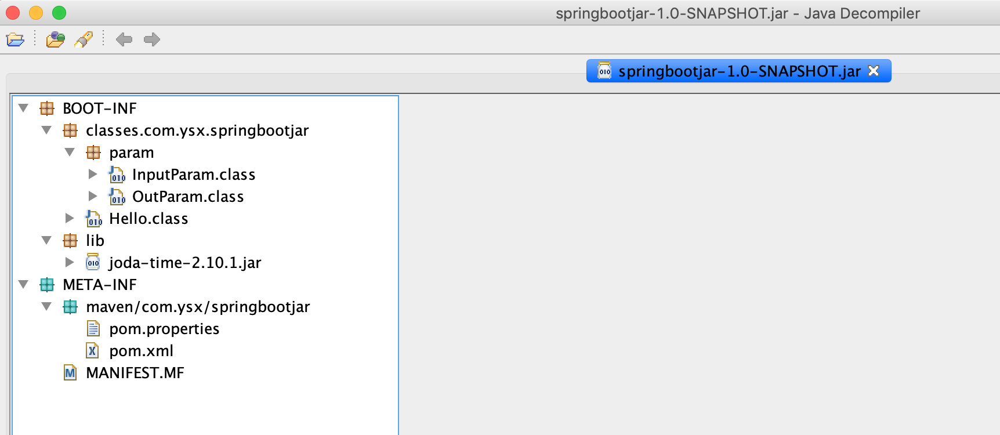
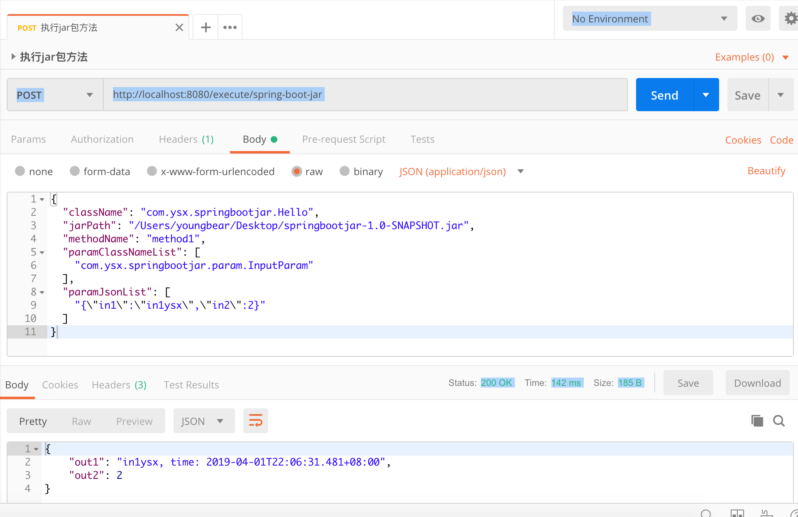

# 解析和执行Jar包中的方法

## 1. 使用spring-boot 的打包插件

打包插件配置：`pom.xml`

```xml
    <build>
        <plugins>
            <plugin>
                <groupId>org.springframework.boot</groupId>
                <artifactId>spring-boot-maven-plugin</artifactId>
                <version>2.1.3.RELEASE</version>
                <configuration>
                    <layout>NONE</layout>
                </configuration>
                <executions>
                    <execution>
                        <goals>
                            <goal>repackage</goal>
                        </goals>
                    </execution>
                </executions>
            </plugin>
        </plugins>
    </build>
```

`layout` 配置为 `NONE` 表示打包的结果包含所有依赖，并且不会包含spring-boot-loader。

spring-boot 打包插件的详细，请参考[官方文档](<https://docs.spring.io/spring-boot/docs/current/maven-plugin/usage.html>)。

如 [springbootjar](./springbootjar) ，使用 `mvn clean package` 打包后，jar 包的结构如下：




## 2. 核心代码

工程依赖于 `spring-boot-loader` ，相关 `pom` 配置为：

```xml
        <dependency>
            <groupId>org.springframework.boot</groupId>
            <artifactId>spring-boot-loader</artifactId>
            <version>2.1.3.RELEASE</version>
            <scope>provided</scope>
        </dependency>
```

新建一个类 `MyLauncher` ，继承于 `JarLauncher`，然后对外暴露一个方法，提供 ClassLoader，这个类加载器，就可以加载使用 `spring-boot-maven-plugin` 打的 jar 包中的方法了。

具体代码如下：

```java
package com.ysx.execute.utils;

import org.springframework.boot.loader.JarLauncher;
import org.springframework.boot.loader.archive.Archive;
import org.springframework.boot.loader.jar.JarFile;

/**
 * @author youngbear
 * @email youngbear@aliyun.com
 * @date 2019-04-01 07:45
 * @blog https://blog.csdn.net/next_second
 * @github https://github.com/YoungBear
 * @description
 */
public class MyLauncher extends JarLauncher {
    public MyLauncher(Archive archive) {
        super(archive);
    }

    /**
     * 获取 ClassLoader
     *
     * @return
     * @throws Exception
     */
    public ClassLoader getClassLoader() throws Exception {
        JarFile.registerUrlProtocolHandler();
        ClassLoader classLoader = createClassLoader(getClassPathArchives());
        return classLoader;
    }
}
```


具体执行方法的代码如下：

```java
package com.ysx.execute.service.impl;

import com.google.gson.Gson;
import com.ysx.execute.entity.RequestExecuteEntity;
import com.ysx.execute.service.IExecuteService;
import com.ysx.execute.utils.MyLauncher;
import org.slf4j.Logger;
import org.slf4j.LoggerFactory;
import org.springframework.boot.loader.archive.JarFileArchive;
import org.springframework.stereotype.Service;

import java.io.File;
import java.lang.reflect.Method;
import java.net.URLClassLoader;
import java.util.ArrayList;
import java.util.List;

/**
 * @author youngbear
 * @email youngbear@aliyun.com
 * @date 2019-04-01 20:42
 * @blog https://blog.csdn.net/next_second
 * @github https://github.com/YoungBear
 * @description
 */
@Service
public class ExecuteServiceImpl implements IExecuteService {

    private static final Logger LOGGER = LoggerFactory.getLogger(ExecuteServiceImpl.class);
    private static final Gson GSON = new Gson();

    @Override
    public String executeSpringBootJar(RequestExecuteEntity requestExecuteEntity) throws Exception {
        String jarPath = requestExecuteEntity.getJarPath();
        String className = requestExecuteEntity.getClassName();
        String methodName = requestExecuteEntity.getMethodName();
        List<String> paramClassNameList = requestExecuteEntity.getParamClassNameList();
        List<String> paramJsonList = requestExecuteEntity.getParamJsonList();

        // 使用本地jar文件，创建一个 JarFileArchive
        JarFileArchive jarFileArchive = new JarFileArchive(new File(jarPath));
        // 根据 JarFileArchive 创建一个 MyLauncher 对象，用于获取 类加载器
        MyLauncher myLauncher = new MyLauncher(jarFileArchive);
        ClassLoader classLoader = myLauncher.getClassLoader();

        // 使用类加载器，获取相关 Class<?> 对象，最后使用反射调用方法
        Class<?> aClass = classLoader.loadClass(className);
        List<Class<?>> paramClassList = new ArrayList<>();
        for (String paramClassName : paramClassNameList) {
            paramClassList.add(classLoader.loadClass(paramClassName));
        }
        Class<?>[] paramClassArray = paramClassList.toArray(new Class<?>[0]);

        List<Object> paramObjectList = new ArrayList<>();
        for (int i = 0; i < paramJsonList.size(); i++) {
            paramObjectList.add(GSON.fromJson(paramJsonList.get(i), paramClassList.get(i)));
        }

        Object[] paramObjectArray = paramObjectList.toArray(new Object[0]);

        Method method = aClass.getDeclaredMethod(methodName, paramClassArray);

        Object obj = aClass.newInstance();
        Object result = method.invoke(obj, paramObjectArray);
        LOGGER.info("result: {}", GSON.toJson(result));

        // 执行完成后，关闭 ClassLoader
        if (classLoader instanceof URLClassLoader) {
            ((URLClassLoader) classLoader).close();
        }

        return GSON.toJson(result);
    }
}
```


## 3. 请求示例

本地使用 SpringBoot 启动 [execute](./execute) 工程后(`mvn spring-boot:run`)，可以访问SwaggerUI文档地址：<http://localhost:8080/swagger-ui.html>


http 请求入参：

```json
{
  "className": "com.ysx.springbootjar.Hello",
  "jarPath": "/Users/youngbear/Desktop/springbootjar-1.0-SNAPSHOT.jar",
  "methodName": "method1",
  "paramClassNameList": [
    "com.ysx.springbootjar.param.InputParam"
  ],
  "paramJsonList": [
    "{\"in1\":\"in1ysx\",\"in2\":2}"
  ]
}
```

执行结果如下图：




# 参考

[1. springboot应用启动原理(二) 扩展URLClassLoader实现嵌套jar加载](https://segmentfault.com/a/1190000013532009)

[2. spring boot应用启动原理分析](https://yq.aliyun.com/articles/6056)

[3. spring boot应用启动原理分析](http://hengyunabc.github.io/spring-boot-application-start-analysis/)